# 🏨 Hotel Bookings Business Intelligence Dashboard – Power BI

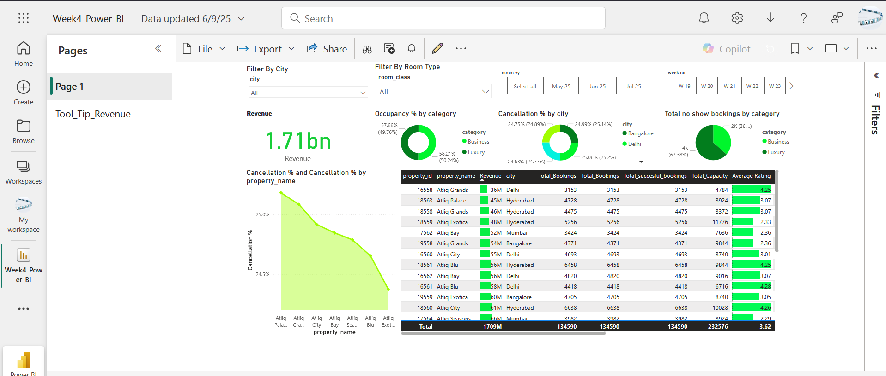

## 📌 Project Overview

This project showcases a comprehensive **Business Intelligence (BI)** solution developed using **Power BI**, focusing on hotel booking data analysis. It was completed as part of the **Cyber Shujaa Program** under the Data and AI track.

The main objective was to create an interactive dashboard that enables hotel stakeholders to understand booking trends, revenue patterns, occupancy rates, and key performance indicators across different hotel properties and room classes.

---

## 🎯 Objectives

- Understand hotel business context and key KPIs.
- Load and transform raw datasets using Power Query.
- Model data using a **Star Schema**.
- Create calculated columns and measures using **DAX**.
- Design a business-focused interactive dashboard.
- Publish and share the dashboard publicly.
- Document the process and insights for professional presentation.

---

## 📊 Features & Visualizations

| Feature | Description |
|--------|-------------|
| **Bookings by Platform** | Bar chart showing dominant booking channels like MakeMyTrip and LogTrip. |
| **Bookings by Room Class** | Highlights most popular room types. |
| **Booking Status** | Donut chart showing success vs. cancellation. |
| **Bookings by City** | Identifies top-performing locations. |
| **Occupancy Rate by Room Class** | Shows efficiency in room utilization. |
| **Average Revenue by Room Class** | Demonstrates profitability. |
| **Day Type Bookings** | Weekday vs. weekend trends. |
| **Monthly Revenue** | Time-series view of revenue peaks and dips. |

> ## 📸 Screenshots & Visual Explanations

---

### 🧾 Data Loading in Power Query

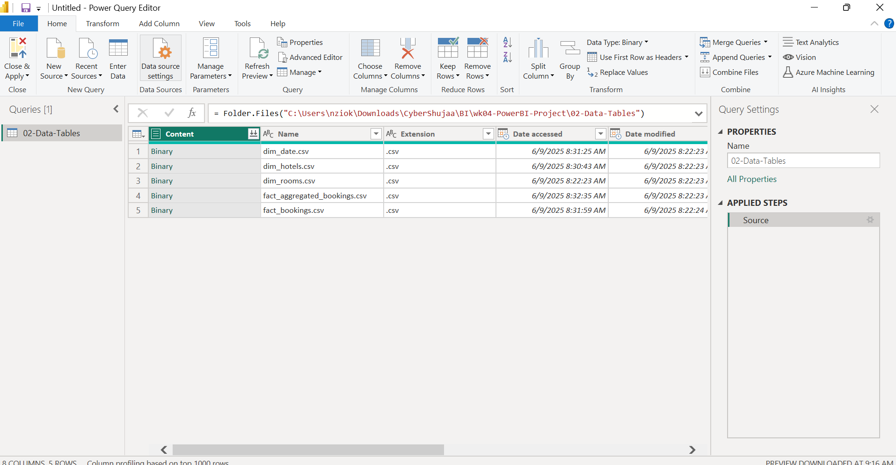

**🔹 Data Loading & Transformation – Power Query Editor**  
This screenshot shows the initial data import and transformation phase in Power BI using Power Query Editor. Datasets such as `fact_bookings.csv`, `fact_aggregated_bookings.csv`, `dim_date.csv`, `dim_hotels.csv`, and `dim_rooms.csv` were loaded. Columns were renamed for clarity, data types corrected (e.g., date fields), and additional time-based columns such as Year, Month, and Weekday were created for better temporal analysis.

---

### 🧩 Data Model – Star Schema

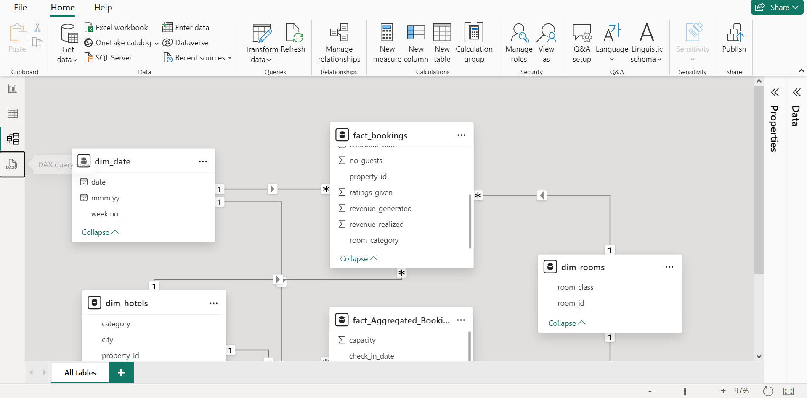

**🔹 Star Schema Data Model**  
The data model follows a **star schema** design, optimized for reporting. At the center is the `fact_bookings`,`fact_aggregate_booking` tables, connected to dimension tables including `dim_date`, `dim_hotels`, and `dim_rooms`. The model supports:
This structure enables efficient querying and supports flexible, high-performance reporting.

---

### 🧮 DAX Measures and Calculated Columns

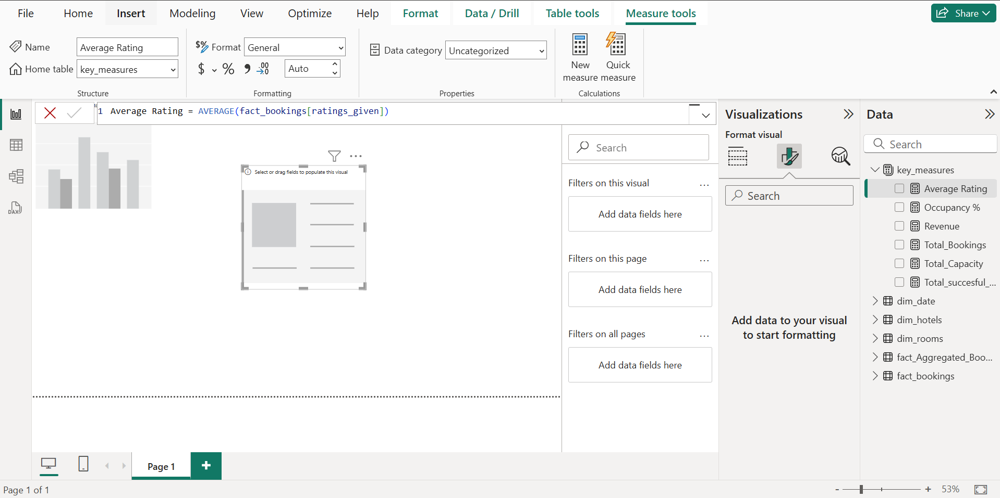
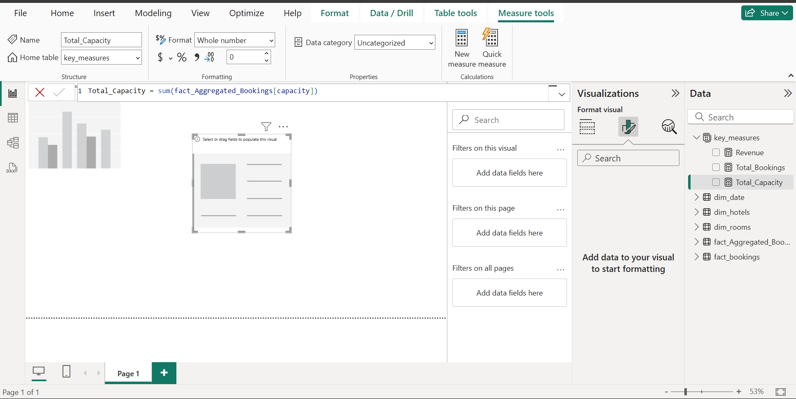
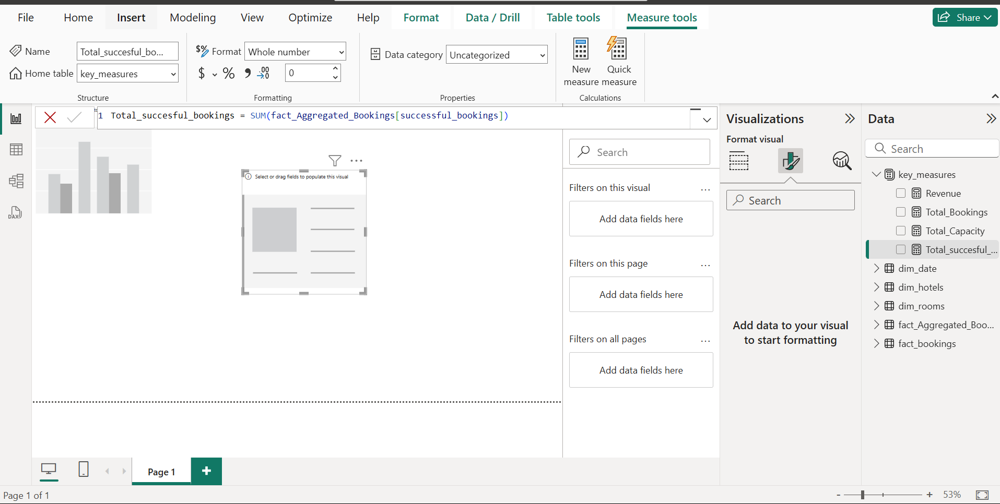

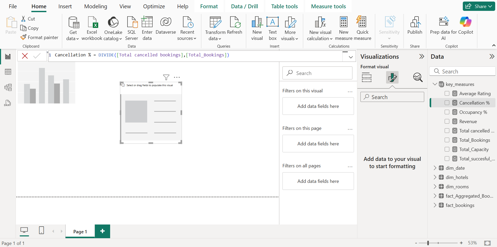
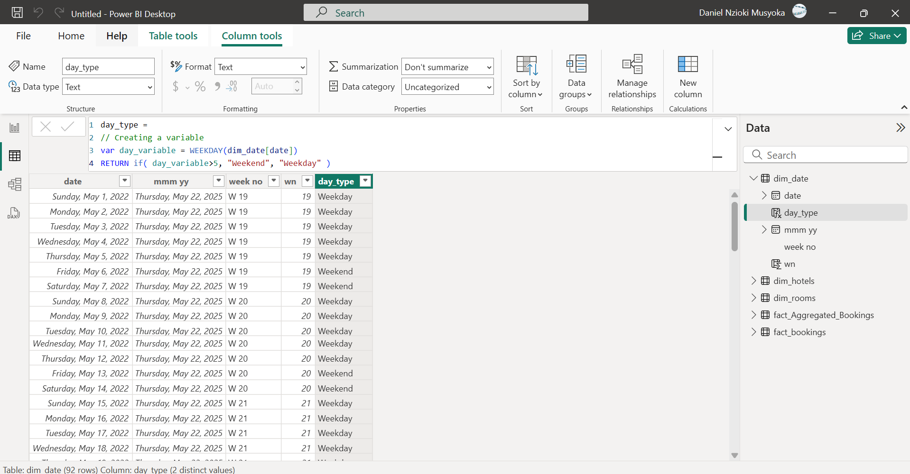
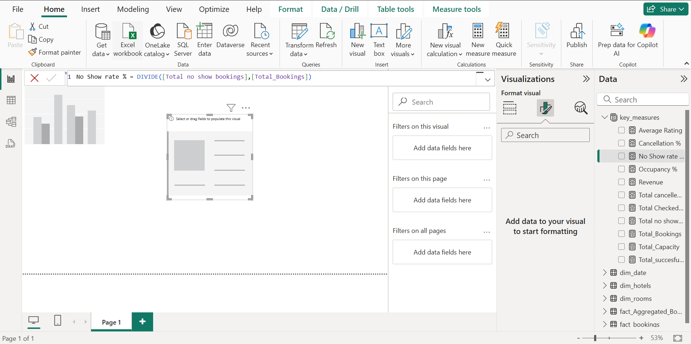
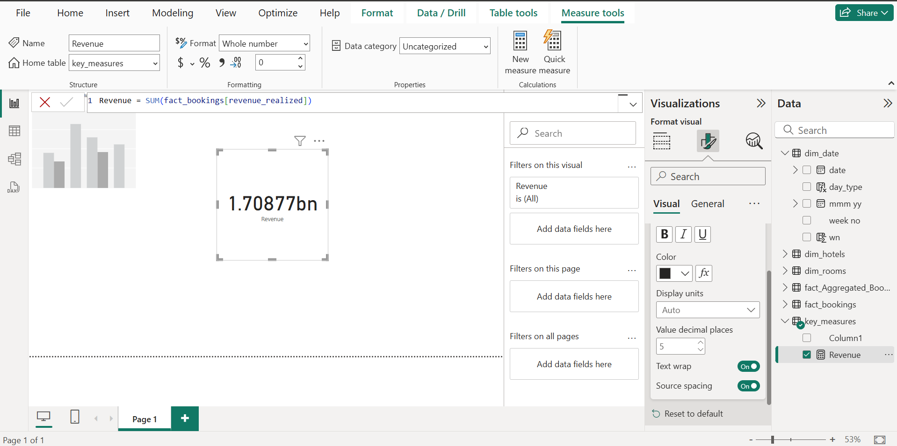
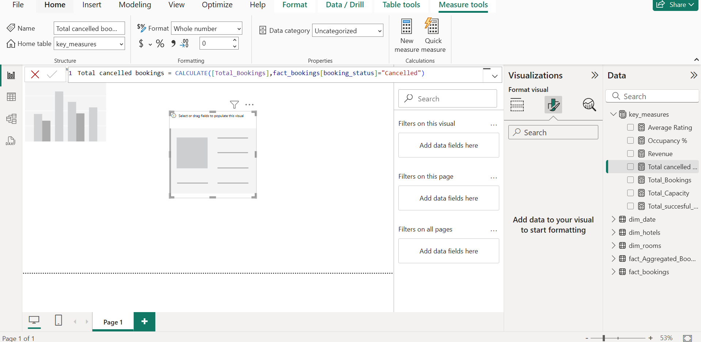
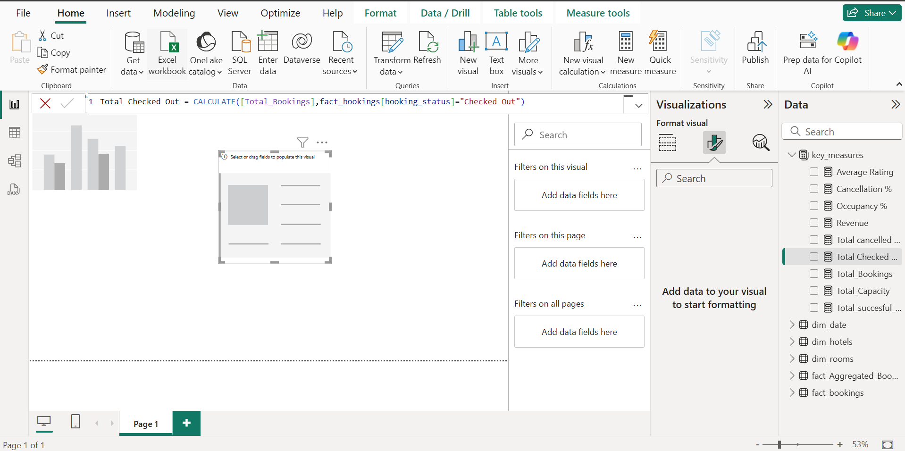
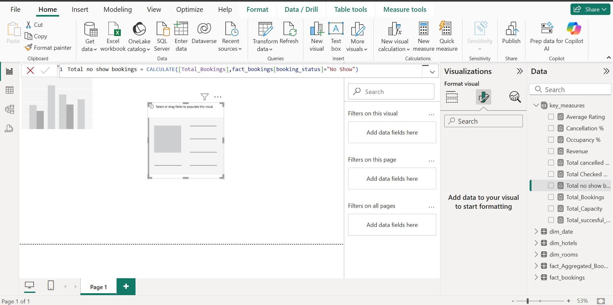

## 📊 Power BI Measures and Calculations

Custom DAX expressions were created to enhance the analytical capability of the Power BI model. Below is a consolidated list of key DAX measures and calculated columns used:

-- 📅 Time Intelligence
wn = WEEKNUM(dim_date[date]) 

day type =
Var wkd = WEEKDAY(dim_date[date],1) 
return
IF(
wkd>5,"Weekend","Weekday") 

-- 💰 Revenue & Booking Performance
Revenue = SUM(fact_bookings[revenue_realized]) 

Total Bookings = COUNT(fact_bookings[booking_id]) 

Total Capacity = SUM(fact_aggregated_bookings[capacity]) 

Total Succesful Bookings = SUM(fact_aggregated_bookings[successful_bookings]) 

Cancellation % = DIVIDE([Total cancelled bookings],[Total Bookings]) 

No Show rate % = DIVIDE([Total no show bookings],[Total Bookings]) 

Total cancelled bookings = CALCULATE([Total Bookings],fact_bookings[booking_status]="Cancelled") 

Total Checked Out = CALCULATE([Total Bookings],fact_bookings[booking_status]="Checked Out") 

-- ⭐ Customer Insights
Average Rating = AVERAGE(fact_bookings[ratings_given])

---

### 📊 Dashboard Overview

## Executive Summary

This dashboard provides a comprehensive overview of our hospitality business performance across key metrics: revenue, occupancy, bookings, cancellations, and customer satisfaction. It is designed to help stakeholders quickly understand trends, identify areas for improvement, and make data-driven decisions.

---

## Key Metrics at a Glance

| Metric                     | Value/Observation             |
|----------------------------|------------------------------|
| **Total Revenue**          | 1.71 billion                 |
| **Total Bookings**         | 134,590                      |
| **Total Capacity**         | 232,576                      |
| **Average Rating**         | 3.62                         |
| **Top Cities by Revenue**  | Delhi, Hyderabad             |
| **Highest Rated Property** | Atliq Blu (Bangalore, 4.38)  |
| **Avg. Cancellation Rate** | ~24.75%                      |
| **No-Show (Business)**     | 4K (63.38%)                  |
| **No-Show (Luxury)**       | 2K (36.62%)                  |

---

## Dashboard Sections Explained

### 1. **Revenue Performance**
- **What it shows:** Total revenue generated across all properties and cities.
- **Why it matters:** Indicates the financial health and growth trajectory of our portfolio.

### 2. **Occupancy & Booking Trends**
- **What it shows:** Breakdown of bookings and occupancy rates by Business and Luxury segments.
- **Why it matters:** Helps us understand demand patterns and optimize our offerings.

### 3. **Cancellation & No-Show Analysis**
- **What it shows:** Cancellation rates by city and segment, and no-show statistics.
- **Why it matters:** Highlights potential revenue leakage and areas for process improvement.

### 4. **City & Property Performance**
- **What it shows:** Revenue, bookings, and ratings by city and property.
- **Why it matters:** Identifies top and underperforming locations for targeted action.

### 5. **Customer Satisfaction**
- **What it shows:** Average ratings and feedback trends.
- **Why it matters:** Directly impacts brand reputation and repeat business.

### 6. **Time-Based Filtering**
- **What it shows:** Ability to filter data by week or month.
- **Why it matters:** Enables tracking of seasonal trends and campaign effectiveness.

---

## Actionable Insights

- **Reduce Cancellations:** Focus on cities with higher cancellation rates to improve revenue retention.
- **Enhance Guest Experience:** Prioritize service improvements at lower-rated properties.
- **Address No-Shows in Business Segment:** Implement strategies such as reminders or flexible policies.
- **Leverage Best Practices:** Replicate successful tactics from top-performing properties across the network.

---

---

*This dashboard is a living tool—please share your feedback or requests for additional insights!*

---

### ☁️ Dashboard Publishing Confirmation

**🔗 Published Dashboard**  
The final dashboard was published to Power BI Service and configured for public access. This screenshot confirms the dashboard's availability for external viewing, making it accessible via the shared link and suitable for integration into a professional data portfolio.

---

---

## 🛠️ Tools Used

- **Power BI Desktop**
- Power Query
- DAX (Data Analysis Expressions)
- Data Modeling (Star Schema)
- Power BI Service (for publishing)

---

## 🔗 Dashboard Link

# 📊 Power BI Dashboard Now Live!

Explore our interactive data visualization:**| [View the Dashboard →](https://app.powerbi.com/groups/me/reports/d95a35de-d5c4-4d67-b77d-038a1f8f0a10/90da962ccb3a4f1211ef?experience=power-bi)**

✨ Features:
- Real-time data analytics
- Interactive visualizations
- Mobile-responsive design
- Custom business insights

*Data tells the story - discover yours today!*

---

# 🔍 Power BI Dashboard Project

## 📦 Get the Dashboard

([Dashbord_Project_Git/Week4_Power_BI.pbix](https://github.com/Daniel059/Hotel-Bookings_power-BI/blob/main/Dashbord_Project_Git/Week4_Power_BI.pbix))

### 🛠️ How to Use
1. **Download** the `.pbix` file above
2. **Open** in [Power BI Desktop](https://aka.ms/pbidesktop) (free)
3. **Refresh** data connections if needed
4. **Explore** interactive visuals

✨ **Pro Tip:** Customize with your own data!

## 🌟 Features
- Interactive reports & bookmarks
- Dynamic DAX measures
- Mobile-responsive layout
- Theme customization

---

## 🙋 About the Author

**Daniel Nzioki Musyoka**  
Connect with me on [LinkedIn](https://linkedin.com/in/your-profile)  
Visit my [Portfolio Website](Dashbord_Project_Git/Documentation/Daniel_Nzioki_Musyoka_Week4_Power_Bi.pdf)

---

## 📝 License

This project is for educational purposes under the Cyber Shujaa Program. You may reuse components with attribution.
